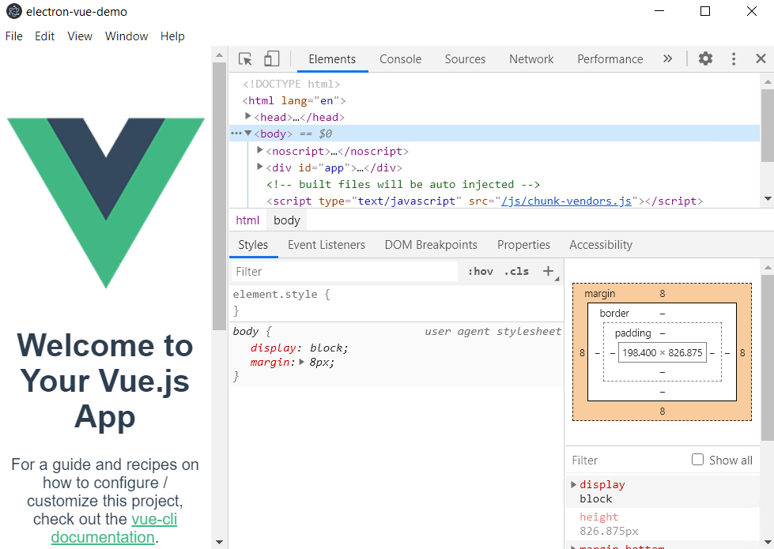

# electron9.0+vue环境搭建

[1-安装node](#1-安装node)

[2-安装cnpm](#2-安装cnpm)

[3-卸载旧版vue-cli](#3-卸载旧版vue-cli)

[4-安装vue-cli](#4-安装vue-cli)

[5-拷贝electron安装包](#5-拷贝electron安装包)

[6-创建vue项目](#6-创建vue项目)

[7-添加electron-builder](#7-添加electron-builder)

[8-安装依赖包](#8-安装依赖包)

[9-运行项目](#9-运行项目)

[10-项目打包](#10-项目打包)

[11-安装包下载](#11-安装包下载)


本教程使用最新electron9.0.2版本+vue进行环境搭建


### 1-安装node

``` shell
安装包：node-v12.18.0-x64.msi   node -v v12.18.0  npm -v 6.14.4 
```

### 2-安装cnpm

``` shell
#全局安装
cnpm npm install cnpm -g --registry=https://registry.npm.taobao.org 
```

``` shell
cnpm -v cnpm@6.1.1 (C:\Users\WDAGUtilityAccount\AppData\Roaming\npm\node_modules\cnpm\lib\parse_argv.js) npm@6.14.5 (C:\Users\WDAGUtilityAccount\AppData\Roaming\npm\node_modules\cnpm\node_modules\npm\lib\npm.js) node@12.18.0 (C:\Program Files\nodejs\node.exe) npminstall@3.27.0 (C:\Users\WDAGUtilityAccount\AppData\Roaming\npm\node_modules\cnpm\node_modules\npminstall\lib\index.js) prefix=C:\Users\WDAGUtilityAccount\AppData\Roaming\npm win32 x64 10.0.19041 registry=https://r.npm.taobao.org 


```

### 3-卸载旧版vue-cli 

全新安装可跳过

``` shell
# 之前安装过2.9.6版本的vue-cli，进行卸载 
npm uninstall -g vue-cli 
```

### 4-安装vue-cli

``` shell
# 全局安装
vue-cli cnpm install -g @vue/cli 
# 查看版本信息
vue -V @vue/cli 4.4.1 
```


### 5-拷贝electron安装包

将package.zip的文件解压至C:\Users\${用户名}\AppData\Local  

最终目录结构  C:\Users\${用户名}\AppData\Local\electron 

C:\Users\${用户名}\AppData\Local\electron-builder 


------

**注意：**

这里提供了electron-vue-demo.zip的精简demo和6、7步骤创建的项目一致，

如果想快速运行项目可直接跳到第8步，如果想体验完整的搭建步骤可按顺序搭建

------


### 6-创建vue项目

``` shell
vue create test 
```


### 7-添加electron-builder

```shell
vue add electron-builder 
```

```shell
Downloading electron-v9.0.2-win32-x64.zip: [-----------------------------------------------------] 0%  > electron@9.0.2 postinstall C:\Users\WDAGUtilityAccount\Desktop\test\node_modules\electron > node install.js  

容易卡死，不用管 直接ctrl+c ，然后删除node_modules 目录
```


### 8-安装依赖包

``` she
cnpm install 
```


``` shell
遇到如下错误可忽略：  × Install fail! RunScriptError: post install error, please remove node_modules before retry! Run "C:\Windows\system32\cmd.exe /d /s /c electron-builder install-app-deps" error, exit code 1 RunScriptError: Run "C:\Windows\system32\cmd.exe /d /s /c electron-builder install-app-deps" error, exit code 1     at ChildProcess.<anonymous> (C:\Users\WDAGUtilityAccount\AppData\Roaming\npm\node_modules\cnpm\node_modules\runscript\index.js:96:21)     at ChildProcess.emit (events.js:315:20)     at maybeClose (internal/child_process.js:1021:16)     at Process.ChildProcess._handle.onexit (internal/child_process.js:286:5) 
```


### 9-运行项目

``` shell
npm run electron:serve 
```





### 10-项目打包

``` shell
npm run electron:build 
```

打包完成后，会在项目的dist_electron目录生成Setup.exe的安装文件，点击即可安装


### 11-安装包下载

```
安装包下载：

链接：https://pan.baidu.com/s/1d7Ri1GVpLtW0gKE5yW__eQ 
提取码：s118
```

